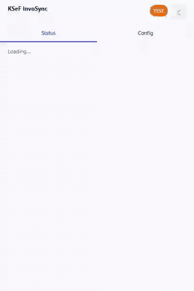
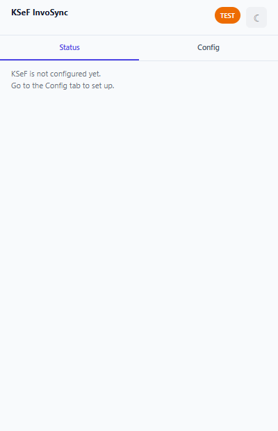
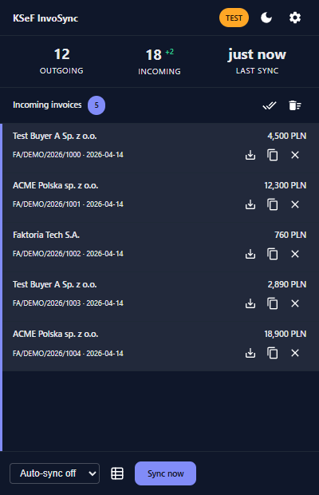
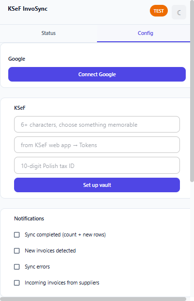
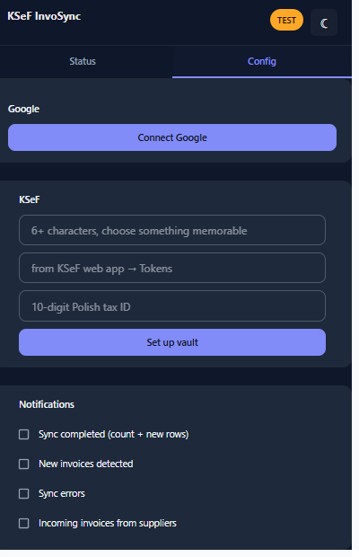
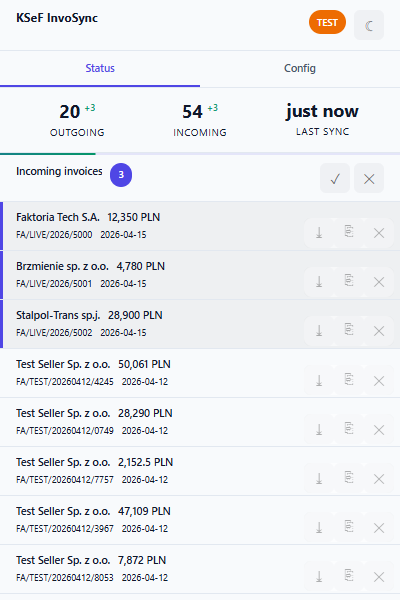
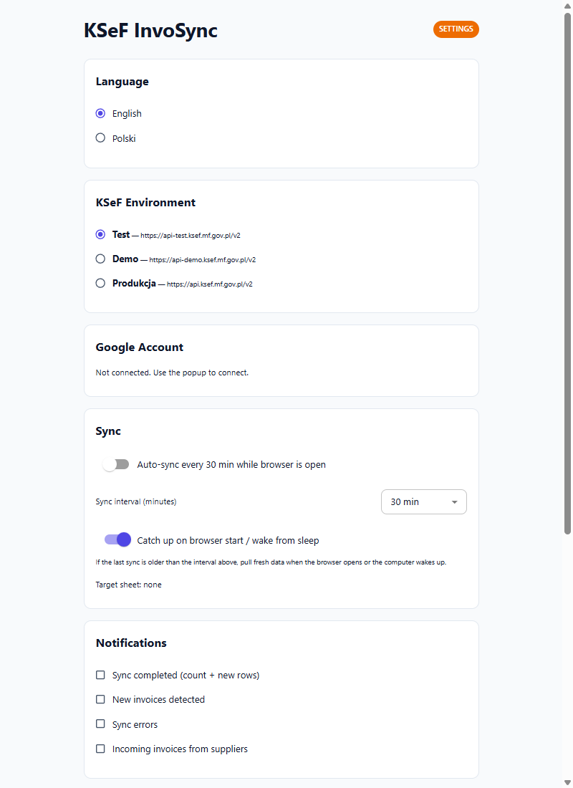
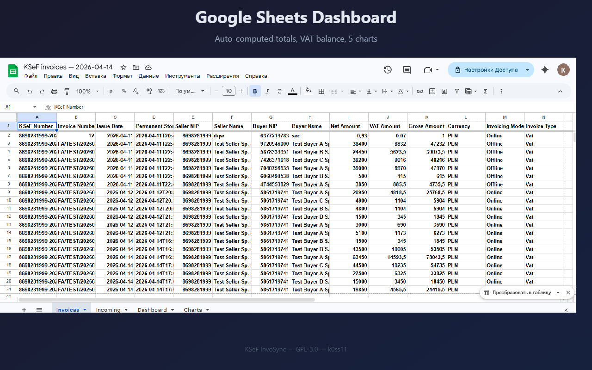

# KSeF InvoSync

**Sync invoices from Polish KSeF to Google Sheets — automatically.**

Free, open-source browser extension (MV3). No backend, no paid accounts, no infrastructure. Your browser + your Google account + your KSeF token = full invoice sync.

> **[🇵🇱 Wersja polska poniżej](#-ksef-invosync--wersja-polska)**

---

## Demo

<p align="center">
  
</p>

Vault setup, baseline sync, then three fresh incoming invoices arrive at the top of the feed with the unread highlight. Higher-quality original: [webm](docs/videos/live-demo.webm) · [mp4](docs/videos/live-demo.mp4).

<details>
<summary><strong>📸 Screenshots</strong> — click to expand</summary>

<p align="center">
  
  
</p>

<p align="center">
  
  
</p>

<p align="center">
  
</p>

<p align="center">
  
</p>

<p align="center">
  
</p>

</details>

---

## Features

- 🔄 **Sync invoices from KSeF** — outgoing and incoming, with desktop notifications when new ones arrive
- 📊 **Send to Google Sheets** — your own spreadsheet, your own account, dashboard with totals + charts
- 📅 **Add to Google Calendar** — payment due dates land on the calendar of your choice with reminders
- ⏱ **Runs in the background** — auto-syncs on a schedule even when the popup isn't open; catches up after browser wake or sleep
- 🔒 **Local-only, encrypted** — KSeF token encrypted with your passphrase; no backend, no telemetry, no servers we control

<details>
<summary><strong>Full feature list</strong> — click to expand</summary>

- **Auto-sync** — pulls invoices from KSeF every 30 min / 1 h / 3 h / 6 h in the background (configurable)
- **Outgoing + Incoming tabs** — Subject1 + Subject2 queries written to separate sheet tabs
- **Incoming invoice feed** — messenger-style list in the popup with unread badges, click to view
- **Invoice viewer** — inline FA(3) XML parser: seller, buyer, line items, totals, due-date banner
- **Add to Calendar** — one click adds the payment due date to your Google Calendar with 3-day + 1-day reminders; target calendar is user-pickable
- **Catch-up on resume** — pulls fresh data when the browser starts or the computer wakes from sleep, if the last sync is older than the configured interval
- **Diagnostic logs viewer** — in-memory ring buffer of service-worker events with Copy-to-clipboard, for bug reports
- **Dashboard** — auto-computed totals (net, VAT, gross, balance) + 5 charts
- **Dedup** — only new invoices are appended, never duplicates
- **Notifications** — Chrome desktop notifications for new invoices, sync results, errors (each toggleable)
- **Encrypted vault** — KSeF token encrypted with PBKDF2 (310 k iterations) + AES-256-GCM, passphrase-protected
- **Remember passphrase** — optional, survives browser restart for unattended auto-sync
- **Dark mode** — MUI theme, follows system or manual toggle
- **i18n** — English + Polish, switchable in settings
- **KSeF environment switch** — test / demo / production
- **Connection test** — verify your KSeF token works before syncing
- **Sheet picker** — choose which spreadsheet to sync to, or create a new one
- **Per-direction sheet sync toggles** — write outgoing only, incoming only, or both
- **Status badge** — colored dot on the extension icon shows sync health at a glance
- **Progress bar** — visual countdown to the next auto-sync
- **GPL-3.0** — free software, no commercial reuse without sharing code

</details>

## Quick Start

1. Install the extension (Chrome Web Store / Firefox AMO — coming soon)
2. Click the extension icon → **Config** tab
3. Paste your KSeF token (NIP auto-detected) → set a passphrase → **Set up vault**
4. Connect Google → authorize Sheets + Drive access
5. Switch to **Status** tab → **Sync now**
6. Open the 📊 sheet link to see your invoices + dashboard

## Tech Stack

- TypeScript + React + Material UI (MUI) on Emotion
- Manifest V3 (Chrome + Firefox)
- esbuild (no Vite, no webpack)
- Web Crypto API (PBKDF2, AES-GCM, RSA-OAEP)
- Playwright e2e tests in Docker

## Development

```bash
# Install
npm install

# Build Chrome
npm run build:chrome

# Build Firefox
npm run build:firefox

# Run tests (Docker required)
npm run test:docker

# Load in Chrome
# 1. chrome://extensions → Developer mode ON
# 2. Load unpacked → select dist/chrome/
```

### Environment Variables

Copy `.env.example` → `.env` and fill in:

```
GOOGLE_CLIENT_ID=your-oauth-client-id
GOOGLE_CLIENT_SECRET=your-oauth-client-secret
```

### Google OAuth Setup

1. Go to [Google Cloud Console → Credentials](https://console.cloud.google.com/apis/credentials)
2. Create an OAuth 2.0 Client ID — choose **"Web application"** type (required because the extension uses `chrome.identity.launchWebAuthFlow`, not `getAuthToken`)
3. Add an **Authorized redirect URI**: `https://<your-extension-id>.chromiumapp.org/`
4. Copy the **Client ID** and **Client Secret** into your `.env`

> **Security note for fork authors:**
> - The `client_secret` for installed/desktop/extension OAuth is treated by Google as a [public identifier](https://developers.google.com/identity/protocols/oauth2/native-app#creatingcred), not a true secret — it ships inside every built extension. PKCE protects the actual token exchange.
> - **Do not** reuse your production Web application credentials. Create a separate OAuth client specifically for the extension.
> - The `GOOGLE_CLIENT_SECRET` field is optional — if your OAuth client type is "Chrome extension" (which uses `getAuthToken` instead), leave it blank. This codebase uses `launchWebAuthFlow` + PKCE, which requires "Web application" type with a secret.

## Architecture

```
src/
├── background/          Service worker (MV3)
│   ├── service-worker.ts   Message router + event listeners
│   ├── auto-sync.ts        chrome.alarms + background sync
│   └── notifications.ts    Chrome notifications
├── popup/               Extension popup (React)
│   ├── App.tsx             Tabbed layout: Status | Config
│   └── popup.css           Layout helpers + dark-mode bridges
├── options/             Full-page settings (React)
├── google/              Google APIs (OAuth, Sheets, Drive)
├── ksef/                KSeF APIs (auth, query, upload, FA3)
├── storage/             Vault (encrypted) + persistent config
└── shared/              i18n, messages, errors, logger
```

## License

GPL-3.0-or-later — see [LICENSE](LICENSE)

**Author:** k0ss11

---

# 🇵🇱 KSeF InvoSync — Wersja polska

**Synchronizacja faktur z KSeF do Arkuszy Google — automatycznie.**

Darmowe rozszerzenie przeglądarki (MV3) o otwartym kodzie źródłowym. Bez backendu, bez płatnych kont, bez infrastruktury. Twoja przeglądarka + Twoje konto Google + Twój token KSeF = pełna synchronizacja faktur.

---

## Demo

<p align="center">
  
</p>

Konfiguracja sejfu, wstępna synchronizacja, następnie trzy świeże faktury przychodzące pojawiają się na górze listy z wyróżnieniem nieprzeczytanych. Oryginał w lepszej jakości: [webm](docs/videos/live-demo.webm) · [mp4](docs/videos/live-demo.mp4).

<details>
<summary><strong>📸 Zrzuty ekranu</strong> — kliknij, by rozwinąć</summary>

<p align="center">
  
  
</p>

<p align="center">
  
  
</p>

<p align="center">
  
</p>

<p align="center">
  
</p>

</details>

---

## Funkcje

- 🔄 **Synchronizacja faktur z KSeF** — wychodzące i przychodzące, z powiadomieniami systemowymi o nowych
- 📊 **Eksport do Arkuszy Google** — Twój własny arkusz, Twoje konto, dashboard z podsumowaniami i wykresami
- 📅 **Dodawanie do Kalendarza Google** — terminy płatności trafiają do wybranego kalendarza z przypomnieniami
- ⏱ **Działa w tle** — automatyczna synchronizacja co ustalony interwał, nawet gdy popup nie jest otwarty; nadrabia po wybudzeniu / starcie przeglądarki
- 🔒 **Lokalnie i zaszyfrowane** — token KSeF zaszyfrowany Twoim hasłem; brak backendu, telemetrii, serwerów po naszej stronie

<details>
<summary><strong>Pełna lista funkcji</strong> — kliknij, by rozwinąć</summary>

- **Auto-sync** — pobiera faktury z KSeF co 30 min / 1 h / 3 h / 6 h w tle (konfigurowalny)
- **Wychodzące + Przychodzące** — osobne zakładki w tym samym arkuszu Google (Subject1 + Subject2)
- **Feed faktur przychodzących** — lista w stylu komunikatora z oznaczeniem nieprzeczytanych
- **Podgląd faktury** — parser FA(3) XML w popupie: sprzedawca, nabywca, pozycje, podsumowania, baner z terminem
- **Dodaj do Kalendarza** — jednym kliknięciem dodaje termin płatności do Kalendarza Google z przypomnieniami 3 dni i 1 dzień przed
- **Nadrabianie po wybudzeniu** — pobiera świeże dane gdy przeglądarka startuje lub komputer się budzi, jeśli minął interwał synchronizacji
- **Podgląd logów diagnostycznych** — bufor zdarzeń service-workera z kopiowaniem do schowka, do zgłaszania błędów
- **Dashboard** — automatyczne podsumowania (netto, VAT, brutto, saldo) + 5 wykresów
- **Deduplikacja** — tylko nowe faktury trafiają do arkusza, nigdy duplikaty
- **Powiadomienia** — powiadomienia Chrome o nowych fakturach, wynikach synchronizacji, błędach (każde przełączalne)
- **Szyfrowany sejf** — token KSeF zaszyfrowany PBKDF2 (310 tys. iteracji) + AES-256-GCM, chroniony hasłem
- **Zapamiętaj hasło** — opcjonalnie, przetrwa restart przeglądarki dla auto-sync
- **Tryb ciemny** — motyw MUI, podąża za systemem lub ręczny przełącznik
- **i18n** — angielski + polski, przełączanie w ustawieniach
- **Przełącznik środowiska KSeF** — test / demo / produkcja
- **Test połączenia** — sprawdź czy token KSeF działa przed synchronizacją
- **Wybór arkusza** — wybierz do którego arkusza synchronizować lub utwórz nowy
- **Przełączniki kierunku synchronizacji** — tylko wychodzące, tylko przychodzące, lub oba
- **Ikona statusu** — kolorowa kropka na ikonie rozszerzenia pokazuje stan synchronizacji
- **Pasek postępu** — wizualne odliczanie do następnej auto-synchronizacji
- **GPL-3.0** — wolne oprogramowanie, brak komercyjnego użycia bez udostępnienia kodu

</details>

## Szybki start

1. Zainstaluj rozszerzenie (Chrome Web Store / Firefox AMO — wkrótce)
2. Kliknij ikonę rozszerzenia → zakładka **Konfiguracja**
3. Wklej token KSeF (NIP wykryty automatycznie) → ustaw hasło → **Skonfiguruj sejf**
4. Połącz Google → autoryzuj dostęp do Arkuszy + Dysku
5. Przejdź do zakładki **Status** → **Synchronizuj teraz**
6. Otwórz link 📊 do arkusza, aby zobaczyć faktury + dashboard

## Rozwój

```bash
# Instalacja
npm install

# Budowanie Chrome
npm run build:chrome

# Testy (wymaga Docker)
npm run test:docker

# Załaduj w Chrome
# 1. chrome://extensions → Tryb programisty WŁ
# 2. Załaduj rozpakowane → wybierz dist/chrome/
```

## Licencja

GPL-3.0-or-later — zobacz [LICENSE](LICENSE)

**Autor:** k0ss11
